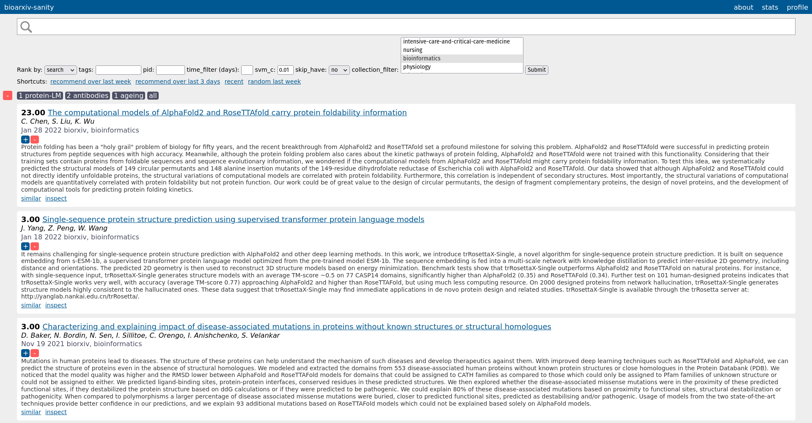

# bioarxiv-sanity-lite
This is a fork of the awesome <a href="https://github.com/karpathy/arxiv-sanity-lite">arxiv-sanity lite</a> by <a href="https://twitter.com/karpathy">@karpathy</a>. The server periodically pulls new papers from <a href="https://www.biorxiv.org/">bioRxiv</a> and <a href="https://www.medrxiv.org/">medRxiv</a> via the official <a href="https://api.biorxiv.org/">bioRxiv API</a>. Then allows users to tag papers of interest, and recommends new papers for each tag based on SVMs over tfidf features of paper abstracts. Allows one to search, rank, sort, slice and dice these results in a pretty web UI. Lastly, bioarxiv-sanity-lite can send you daily emails with recommendations of new papers based on your tags.

A live version of this code is run at: TODO. This instance's paper database has been initialised in June 2022 with data provided by the <a href="https://rxivist.org/">Rxivist</a> paper search engine going all the way back to November 2013. More information about the Rxivist API can be found <a href="https://rxivist.org/docs">here</a> as well as on <a href="https://github.com/blekhmanlab/rxivist">Github</a>.
   
Many thanks to <a href="https://twitter.com/karpathy">@karpathy</a> for building arxiv-sanity-lite, to the Rxivist project for making their historical record publically available and to the developers of the bioRxiv API.



#### To run

To run this locally I usually run the following script to update the database with any new papers. I typically schedule this via a periodic cron job that runs once a day:

```bash
#!/bin/bash

python bioarxiv_daemon.py --date_start=<date> --date_end=<date>

if [ $? -eq 0 ]; then
    echo "New papers detected! Running compute.py"
    python compute.py
else
    echo "No new papers were added, skipping feature computation"
fi
```

You can specify a date interval to search for new papers via the `date_start` and `date_end` flags, which accept strings in the format `YYYY-MM-DD`. If no date interval is specified the daemon searches for new papers between today and yesterday.

You can see that updating the database is a matter of first downloading the new papers via the bioarxiv api using `bioarxiv_daemon.py`, and then running `compute.py` to compute the tfidf features of the papers. Finally to serve the flask server locally we'd run something like:

```bash
export FLASK_APP=serve.py; flask run
```

All of the database will be stored inside the `data` directory. Finally, if you'd like to run your own instance on the interwebs I recommend simply running the above on a [Linode](https://www.linode.com), e.g. I am running this code currently on the smallest "Nanode 1 GB" instance indexing about 30K papers, which costs $5/month.

(Optional) Finally, if you'd like to send periodic emails to users about new papers, see the `send_emails.py` script. You'll also have to `pip install sendgrid`. I run this script in a daily cron job.

#### Requirements

 Install via requirements:

 ```bash
 pip install -r requirements.txt
 ```

#### Todos

- Build category filter to filter bioRxiv and medRxiv collections.

#### License

MIT
